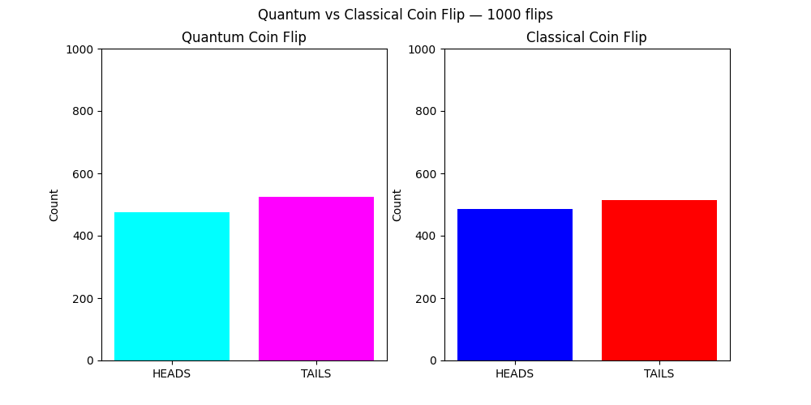

# Quantum Coin Flip Simulator

Simulates 1000 coin flips using both a quantum computer and a classical computer, then compares the results side by side.

## How the Quantum Coin Flip Works

A qubit is placed in superposition using a Hadamard gate — putting it exactly halfway between 0 and 1. When measured, it collapses to either 0 (heads) or 1 (tails) with a genuine 50/50 probability. This randomness comes from the laws of physics, not an algorithm.

## The Key Difference

| | Quantum | Classical |
|---|---|---|
| Source of randomness | Physical superposition collapse | Mathematical algorithm |
| Truly random | Yes | No — pseudorandom |
| Predictable | Never | Yes, if seed is known |
| Method | Hadamard gate + measurement | Mersenne Twister algorithm |

Both produce roughly 50/50 results across 1000 flips. The difference is not in the outcome but in where the randomness comes from. Quantum randomness is guaranteed by nature. Classical randomness is an illusion created by math.

## Results

Both distributions land close to 500 heads and 500 tails across 1000 flips, confirming both methods produce fair coin flips — but through fundamentally different mechanisms.


(NOTE: This is just an example, everytime you run the program you will not see the same graph, but a rough close one)

## Tech Stack

- Python
- Qiskit
- Qiskit Aer
- Matplotlib

## Setup

```bash
pip install qiskit qiskit-aer matplotlib
```

## Key Learnings

- How the Hadamard gate creates superposition
- Why quantum randomness is physically genuine
- Why classical randomness is deterministic underneath
- How to run and analyse quantum circuits using Qiskit